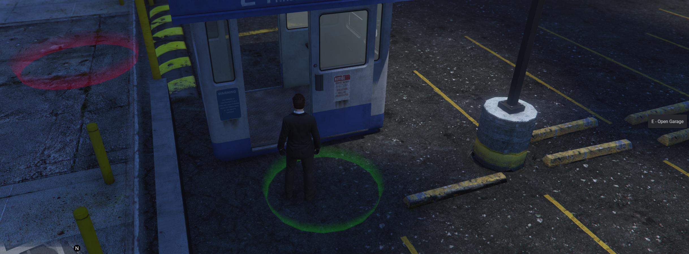

# qbx_garages
Provides an API to store and retrieve vehicles from various locations around the map. Also includes an optional built-in UI

## Features

### Built-in UI
Optionally disabled via config. Created using ox_lib

Configurable Markers Denote the pickup and drop off points

### Export & Callback API
qbx_garages is designed for 3rd party resources to easily replace the built-in UI or interface with the backend. Exports provide functionality to:
- Register garages at runtime
- Move vehicles between garages
- change the depot price of a vehicle

### Access Points
Garages can now have more than one access point. An access point is a location on the map where vehicles in that garage can be accessed.
Access points have their own pick up, drop off, and spawn locations and an optional blip. Additionally, the pick up & drop off points can optionally be combined.

### Access Control
Can limit garage access to a list of jobs/gangs with optional minimum grades. Can also pass a custom canAccess function for more advanced access controls.

### Vehicle Filtering
- Vehicle type filter only grants access to vehicles of a specific type. So that aircraft can't be placed in car garages for example.
- Optional vehicle state filter only grants access to vehicles in one of or a combination of vehicle states: OUT, GARAGED, IMPOUNDED
- Shared flag optionally allows players to access all vehicles in the garage, instead of just vehicles they personally own.
- Garage check optionally allows players to access vehicles not currently in the garage.

## Converting from QB?
- Rather than have predefined garage types, qbx_garages has per garage config flags, allowing for greater flexibility in who can access a garage and what vehicles will be shown.
- Several global settings are now per garage config options.
- To support house garages, pass a custom canAccess function to check owning player

## Dependencies
- qbx_core
- qbx_vehicles
